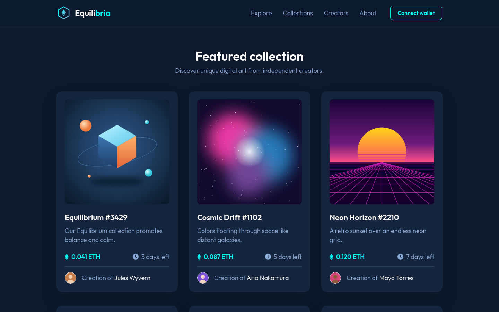
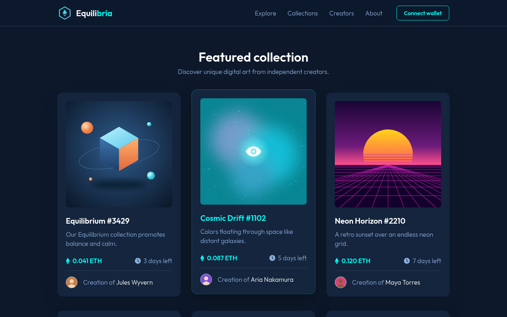
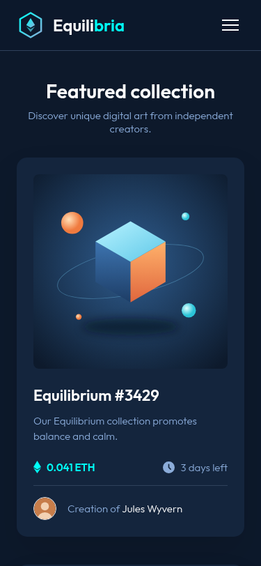
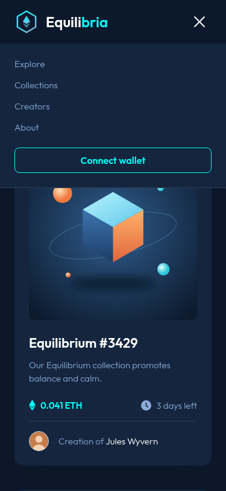

# Equilibria: NFT Gallery

Galeria de NFTs feita a partir do desafio [NFT preview card component](https://www.frontendmentor.io/challenges/nft-preview-card-component-SbdUL_w0U) do Frontend Mentor, com componente de card, lista de cards (CardList) e header.

## Links

- **Site no ar:** https://vitorbernalrodrigues.github.io/nft-preview-card/
- **Repositório:** https://github.com/VitorBernalRodrigues/nft-preview-card

## Tecnologias

- HTML5
- CSS3 (Flexbox, Grid e media queries)
- JavaScript
- [Animate.css](https://animate.style/)
- [Google Fonts](https://fonts.google.com/specimen/Outfit) (Outfit)
- GitHub Pages

## Fotos

### Desktop

### Hover no card

### Mobile

| Página | Menu aberto |
| --- | --- |
|  |  |

## Autores

**Turma:** 6B

- Vitor Hugo Bernal Rodrigues ([@VitorBernalRodrigues](https://github.com/VitorBernalRodrigues))
- Mateus Moreira ([@matin33belike](https://github.com/matin33belike))
- Gustavo Maciel ([@ggustavomaciell01-oss](https://github.com/ggustavomaciell01-oss))
